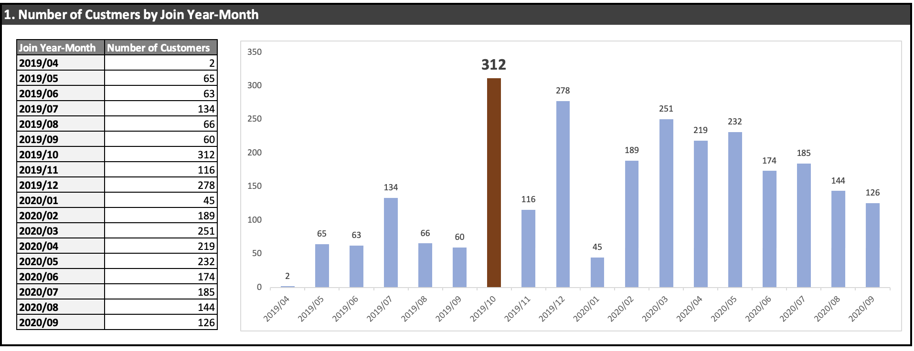
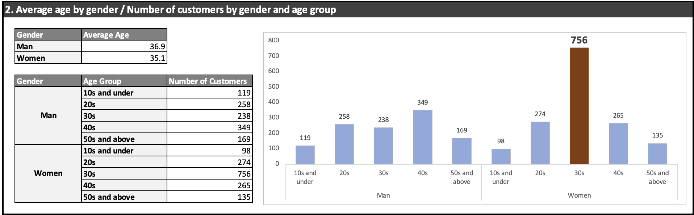
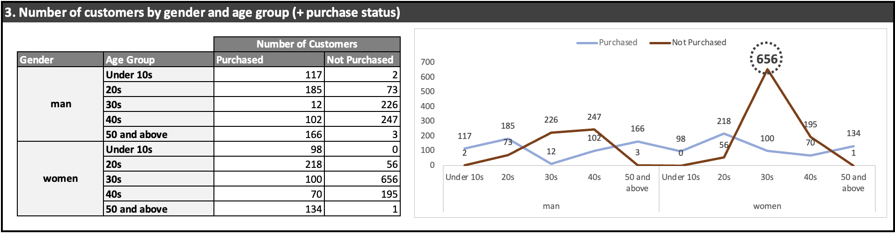
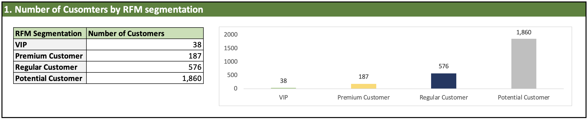
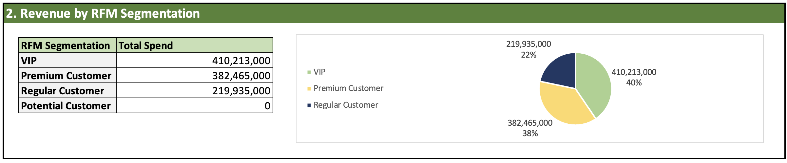
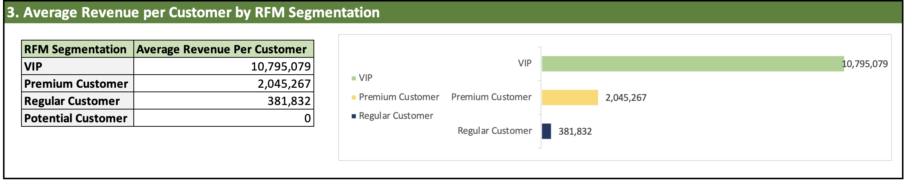
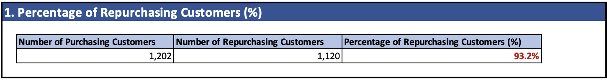
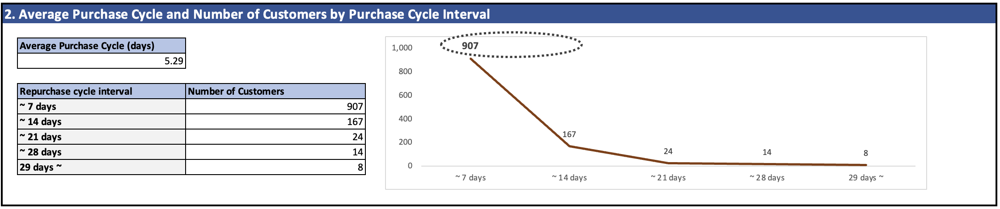

# Customer Value and Growth Project

## Overview
The **Customer Value and Growth Project** is a comprehensive initiative under the broader **SQL-Business-Analytics** framework. It is designed to demonstrate how SQL can be utilized to derive valuable business insights from data. This project focuses on four key areas of analysis to evaluate customer behaviors, product performance, and purchase patterns, ultimately aiding in strategic decision-making.

Using SQL as the core analytical tool, this project processes a **synthetic dataset** that mirrors real-world business data. The dataset includes customer demographics, product sales, purchase transactions, and monetary metrics, providing a robust foundation for the analysis.

The primary goals of the project are:
1. **Customer Profiling**: Understanding the characteristics of customers, including demographics, spending habits, and preferences.
2. **Product Growth Analysis**: Tracking and evaluating product performance and identifying growth opportunities over time.
3. **Purchase Cycle Analysis**: Analyzing customer purchase frequency and cycles to predict future buying behavior.
4. **RFM Segmentation**: Segmenting customers based on Recency, Frequency, and Monetary values to prioritize high-value customer relationships.

By addressing these objectives, the project provides a roadmap for businesses to optimize customer engagement, improve product strategies, and enhance overall profitability. Each analysis is accompanied by well-defined questions, SQL solutions, and actionable insights, ensuring that this project serves as both an educational resource and a practical guide for implementing SQL in business analytics.

---

## Entity-Relationship Diagram (ERD)
Below is the ERD showing the relationships between the tables:  


---

## Analysis Sections

### 1. Customer Profile Analysis

#### Objective
To analyze and define key characteristics of customers, such as demographics, spending behavior, and engagement metrics.

---
### Data Mart for Customer Profile Analysis
```sql
CREATE TABLE customer_profile AS
SELECT A.*
	   ,DATE_FORMAT(JOIN_DATE, "%Y-%m") AS JOIN_YEAR_MONTH
       ,2021 - YEAR(BIRTHDAY) + 1 AS AGE
       ,CASE WHEN 2021 - YEAR(BIRTHDAY) + 1 < 20 THEN "10s and under"
			 WHEN 2021 - YEAR(BIRTHDAY) + 1 < 30 THEN "20s"
             WHEN 2021 - YEAR(BIRTHDAY) + 1 < 40 THEN "30s"
             WHEN 2021 - YEAR(BIRTHDAY) + 1 < 50 THEN "40s"
             ELSE "50s and above" END AS AGE_GROUP
             
	   ,CASE WHEN B.MEM_NO IS NOT NULL THEN "Purchased"
			 ELSE "Not Purchased" END AS Purchase_Status 
FROM CUSTOMER AS A
LEFT
JOIN (SELECT DISTINCT MEM_NO FROM SALES) AS B
  ON A.MEM_NO = B.MEM_NO;
```

#### 1.1 Number of Customers by Join Year-Month
```sql
SELECT JOIN_YEAR_MONTH, COUNT(MEM_NO) AS NUM_CUSTOMER
FROM CUSTOMER_PROFILE
GROUP BY JOIN_YEAR_MONTH;
```
#### Insights
- **October 2019** had the highest number of new customer sign-ups, with **312 customers**.
- Customer acquisition showed **consistent growth** leading up to **December 2019**, with a **sharp peak** in late 2019.
- A **slight decline** was observed after **March 2020**.


#### 1.2 Average age by gender / Number of customers by gender and age group 
```sql
SELECT GENDER, AVG(AGE) AS AVG_AGE
FROM CUSTOMER_PROFILE
GROUP BY GENDER;
```
```sql
SELECT GENDER, AGE_GROUP, COUNT(MEM_NO) AS NUM_CUSTOMER
FROM CUSTOMER_PROFILE
GROUP BY GENDER, AGE_GROUP
ORDER BY GENDER, AGE_GROUP;
```
#### Insights
##### Average Age
- **Men**: 36.9 years  
- **Women**: 35.1 years  
##### Gender and Age Group Distribution
- Among **men**, the **40s** age group has the highest representation (**349 customers**).
- Among **women**, the **30s** age group has the highest representation (**756 customers**), significantly outpacing other groups.


#### 1.3 Number of Customers by Gender and Age Group (Including Purchase Status)
```sql
SELECT GENDER, AGE_GROUP, PURCHASE_STATUS, COUNT(MEM_NO) AS NUM_CUSTOMER
FROM CUSTOMER_PROFILE
GROUP BY GENDER, AGE_GROUP, PURCHASE_STATUS
ORDER BY GENDER, AGE_GROUP, PURCHASE_STATUS;
```
#### Insights
##### For Men:
- Most purchases were made by customers in the **20s** and **50+** age groups.
- The **30s** age group showed the highest "Not Purchased" count (**226**).
##### For Women:
- The **30s** age group displayed a stark contrast with **656 customers not purchasing**, while only **100 customers made purchases**.


___
## 2. RFM Analysis

### Objective
To segment customers based on their Recency, Frequency, and Monetary (RFM) values to identify key customer groups and analyze their contribution to the business.

---
### Data Mart for RFM Analysis
```sql
CREATE TABLE RFM AS 
SELECT A.*, B.TOTAL_SPEND, B.PURCHASE_COUNT
FROM CUSTOMER AS A
LEFT JOIN (SELECT A.MEM_NO, SUM(A.SALES_QTY * B.PRICE) AS TOTAL_SPEND, COUNT(A.ORDER_NO) AS PURCHASE_COUNT
FROM SALES AS A
LEFT JOIN PRODUCT AS B
ON A.PRODUCT_CODE = B.PRODUCT_CODE
WHERE YEAR(A.ORDER_DATE) = '2020'
GROUP BY A.MEM_NO) AS B
ON A.MEM_NO = B.MEM_NO;
```

#### 2.1 Number of Customers by RFM Segmentation
```sql
SELECT  SEGMENTATION, COUNT(MEM_NO) AS NUM_CUSTOMER
  FROM  (SELECT *
		,CASE WHEN TOTAL_SPEND >  5000000 THEN 'VIP Customer'
			  WHEN TOTAL_SPEND >  1000000 OR PURCHASE_COUNT > 3 THEN 'Premium Customer'
		      WHEN TOTAL_SPEND >        0 THEN 'Regular Customer'
			  ELSE 'Potential Customer' END AS SEGMENTATION
		FROM  RFM)AS A
GROUP BY  SEGMENTATION
ORDER BY  NUM_CUSTOMER ASC;
```
#### Insights
- **Potential Customers** represent the largest group, with **1,860 customers**, indicating a **high untapped potential**.
- **Regular Customers** (**576**) and **Premium Customers** (**187**) make up the mid-tier segments.
- **VIP Customers** (**38**) are the smallest yet **high-value segment**.


#### 2.2 Revenue by RFM Segmentation
```sql
SELECT  SEGMENTATION, SUM(TOTAL_SPEND) AS TOTAL_SPEND
  FROM  (SELECT  *
		,CASE WHEN TOTAL_SPEND >  5000000 THEN 'VIP'
			  WHEN TOTAL_SPEND >  1000000 OR PURCHASE_COUNT > 3 THEN 'Premium Customer'
			  WHEN TOTAL_SPEND >        0 THEN 'Regular Customer'
			  ELSE 'Potential Customer' END AS SEGMENTATION
		 FROM  RFM) AS A
GROUP BY  SEGMENTATION
ORDER BY  TOTAL_SPEND DESC;
```
#### Insights
- **VIP Customers** generate the **highest revenue**, contributing **40% of the total spend** with **410,213,000 units**.
- **Premium Customers** follow closely, accounting for **38% of revenue**.
- **Regular Customers** contribute the remaining **22%**.
- **Potential Customers** currently do **not contribute to revenue**, highlighting an **opportunity to engage and convert** this segment.


#### 2.3 Average Revenue per Customer by RFM Segmentation
```sql
SELECT  SEGMENTATION, SUM(TOTAL_SPEND) / COUNT(MEM_NO) AS AVG_REV_PER_CUSTOMER
	FROM  (SELECT  *
		,CASE WHEN TOTAL_SPEND >  5000000 THEN 'VIP'
			  WHEN TOTAL_SPEND >  1000000 OR PURCHASE_COUNT > 3 THEN 'Premium Customer'
			  WHEN TOTAL_SPEND >        0 THEN 'Regular Customer'
			  ELSE 'Potential Customer' END AS SEGMENTATION
		 FROM  RFM) AS A
GROUP BY  SEGMENTATION
ORDER BY  AVG_REV_PER_CUSTOMER DESC;
```
#### Insights

- **VIP Customers** have the **highest average revenue per customer** at **10,795,079**, demonstrating their **substantial value** to the business.
- **Premium Customers** generate an average of **2,045,267**.
- **Regular Customers** contribute **381,832 per person**.
- **Potential Customers** currently generate **no revenue**, reinforcing the **need for targeted marketing strategies**.


___
## 3. Repurchase Rate and Purchase Cycle Analysis

### Objective
To analyze customer repurchase behavior and evaluate purchase cycles to understand customer retention and buying patterns.

---
### Data Mart for Repurchase Rate and Purchase Cycle Analysis
```sql
CREATE TABLE purchase_cycle AS
SELECT  *
        ,CASE WHEN DATE_ADD(FIRST_PUR_DATE, INTERVAL +1 DAY) <= LAST_PUR_DATE THEN 'Y' ELSE 'N' END AS REPUR_STATUS
        ,DATEDIFF(LAST_PUR_DATE, FIRST_PUR_DATE) AS PUR_INTERVAL
        ,CASE WHEN PUR_COUNT - 1 = 0 OR DATEDIFF(LAST_PUR_DATE, FIRST_PUR_DATE) = 0 THEN 0
              ELSE DATEDIFF(LAST_PUR_DATE, FIRST_PUR_DATE) / (PUR_COUNT - 1) END AS PUR_CYCLE
  FROM  (SELECT  MEM_NO
                ,MIN(ORDER_DATE) AS FIRST_PUR_DATE        
                ,MAX(ORDER_DATE) AS LAST_PUR_DATE
                ,COUNT(ORDER_NO) AS PUR_COUNT
          FROM  SALES
         WHERE  MEM_NO <> '9999999' /* Exclude non-members */
      GROUP BY  MEM_NO) AS A;
```

#### 3.1 Percentage of Repurchasing Customers (%)
```sql
SELECT  COUNT(DISTINCT MEM_NO) AS NUM_PUR_CUSTOMER
		,COUNT(DISTINCT CASE WHEN REPUR_STATUS = 'Y' THEN MEM_NO END) AS NUM_REPUR_CUSTOMER
  FROM  purchase_cycle;
```
#### Insights
- Out of **1,202 purchasing customers**, **1,120 customers** made repurchases.
- This results in a **93.2% repurchase rate**, indicating **strong customer retention**.


#### 3.2 Average Purchase Cycle and Number of Customers by Purchase Cycle Interval
```sql
SELECT  AVG(PUR_INTERVAL)
  FROM  purchase_cycle
 WHERE  PUR_INTERVAL > 0;
```

```sql
SELECT  *
		,CASE WHEN PUR_INTERVAL <= 7 THEN 'Within 7 days'
			  WHEN PUR_INTERVAL <= 14 THEN 'Within 14 days'
			  WHEN PUR_INTERVAL <= 21 THEN 'Within 21 days'
			  WHEN PUR_INTERVAL <= 28 THEN 'Within 28 days'
			  ELSE 'After 29 days' END AS REPUR_INTERVAL
  FROM  purchase_cycle
 WHERE  PUR_INTERVAL > 0;
```
```sql
 SELECT  REPUR_INTERVAL, COUNT(MEM_NO) AS NUM_CUSTOMER
   FROM  (SELECT  *
			,CASE WHEN PUR_INTERVAL <= 7 THEN 'Within 7 days'
				  WHEN PUR_INTERVAL <= 14 THEN 'Within 14 days'
				  WHEN PUR_INTERVAL <= 21 THEN 'Within 21 days'
				  WHEN PUR_INTERVAL <= 28 THEN 'Within 28 days'
				  ELSE 'After 29 days' END AS REPUR_INTERVAL
		  FROM  purchase_cycle
		 WHERE  PUR_INTERVAL > 0)AS A
GROUP BY  REPUR_INTERVAL;
```
#### Insights
- The **average purchase cycle** is **5.29 days**, demonstrating **frequent customer purchases**.
- **Most customers (907)** repurchase within **7 days**, showing a strong tendency for quick repeat purchases.
- The number of customers drops significantly for longer intervals:
  - **167 customers** repurchase within **14 days**.
  - Only **8 customers** repurchase after **29 days**.

