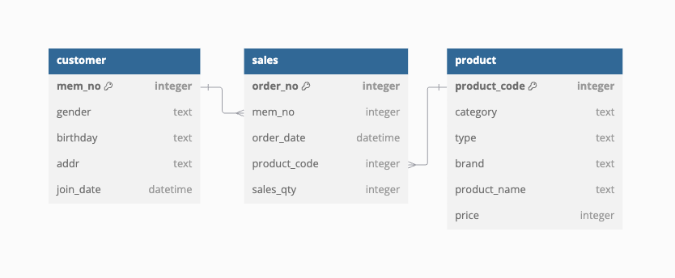

# Customer Value and Growth Project

## Overview
The **Customer Value and Growth Project** is a comprehensive initiative under the broader **SQL-Business-Analytics** framework. It is designed to demonstrate how SQL can be utilized to derive valuable business insights from data. This project focuses on four key areas of analysis to evaluate customer behaviors, product performance, and purchase patterns, ultimately aiding in strategic decision-making.

Using SQL as the core analytical tool, this project processes a **synthetic dataset** that mirrors real-world business data. The dataset includes customer demographics, product sales, purchase transactions, and monetary metrics, providing a robust foundation for the analysis.

The primary goals of the project are:
1. **Customer Profiling**: Understanding the characteristics of customers, including demographics, spending habits, and preferences.
2. **Product Growth Analysis**: Tracking and evaluating product performance and identifying growth opportunities over time.
3. **Purchase Cycle Analysis**: Analyzing customer purchase frequency and cycles to predict future buying behavior.
4. **RFM Segmentation**: Segmenting customers based on Recency, Frequency, and Monetary values to prioritize high-value customer relationships.

By addressing these objectives, the project provides a roadmap for businesses to optimize customer engagement, improve product strategies, and enhance overall profitability. Each analysis is accompanied by well-defined questions, SQL solutions, and actionable insights, ensuring that this project serves as both an educational resource and a practical guide for implementing SQL in business analytics.

---

## Entity-Relationship Diagram (ERD)
Below is the ERD showing the relationships between the tables:  


---

## Analysis Sections

### 1. Customer Profile Analysis

#### Objective
To analyze and define key characteristics of customers, such as demographics, spending behavior, and engagement metrics.

---
### Data Mart for Customer Profile Analysis
```sql
CREATE TABLE customer_profile AS
SELECT A.*
	   ,DATE_FORMAT(JOIN_DATE, "%Y-%m") AS JOIN_YEAR_MONTH
       ,2021 - YEAR(BIRTHDAY) + 1 AS AGE
       ,CASE WHEN 2021 - YEAR(BIRTHDAY) + 1 < 20 THEN "10s and under"
			 WHEN 2021 - YEAR(BIRTHDAY) + 1 < 30 THEN "20s"
             WHEN 2021 - YEAR(BIRTHDAY) + 1 < 40 THEN "30s"
             WHEN 2021 - YEAR(BIRTHDAY) + 1 < 50 THEN "40s"
             ELSE "50s and above" END AS AGE_GROUP
             
	   ,CASE WHEN B.MEM_NO IS NOT NULL THEN "Purchased"
			 ELSE "Not Purchased" END AS Purchase_Status 
FROM CUSTOMER AS A
LEFT
JOIN (SELECT DISTINCT MEM_NO FROM SALES) AS B
  ON A.MEM_NO = B.MEM_NO;


#### 1.1 Number of Customers by Join Year-Month
- **SQL Code**:
  ```sql
  SELECT 
      DATE_FORMAT(join_date, '%Y/%m') AS join_year_month, 
      COUNT(customer_id) AS number_of_customers
  FROM customers
  GROUP BY join_year_month
  ORDER BY join_year_month;
