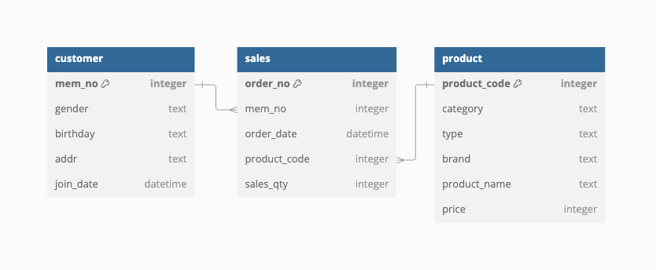

# SQL-Business-Analytics

## Overview
**SQL-Business-Analytics** is a project designed to showcase advanced SQL techniques and business analytics. The project focuses on exploring and analyzing synthetic business data to derive actionable insights. All analyses are performed using SQL queries.
For demonstration purposes, an entirely **synthetic dataset** has been generated and used throughout this project.

## Entity-Relationship Diagram (ERD)
Below is the ERD showing the relationships between the tables:

