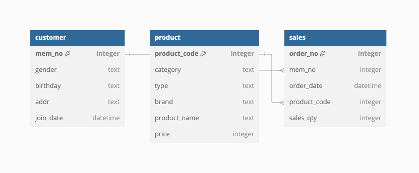

# SQL-RFM-Analysis

Overview
* The SQL-RFM-Analysis project focuses on implementing a Recency, Frequency, and Monetary (RFM) analysis using SQL to assess customer behavior and segmentation. This analysis is a powerful tool for identifying high-value customers, understanding purchasing patterns, and tailoring business strategies accordingly. The dataset used in this project is entirely fictional and has been generated for demonstration purposes only.

Entity-Relationship Diagram (ERD)
Below is the ERD illustrating the relationships between the tables:

