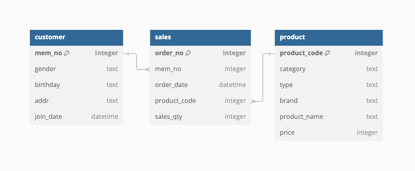

# SQL-RFM-Analysis

## Overview
**SQL-RFM-Analysis** is a project designed to implement Recency, Frequency, and Monetary (RFM) analysis using SQL to evaluate customer behavior and segmentation.  
RFM analysis is a powerful tool for identifying high-value customers, understanding purchasing patterns, and guiding effective business strategies.  
For demonstration purposes, an entirely **synthetic dataset** has been generated and used throughout this project.

## Entity-Relationship Diagram (ERD)
Below is the ERD showing the relationships between the tables:

